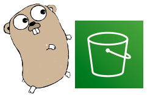

[](https://github.com/seike460/s3ry/actions/workflows/ci.yml)

# s3ry

s3ry is an interactive terminal client for Amazon S3. It is written in Go and uses Bubble Tea.

## Status

This project is being rebuilt on AWS SDK for Go v2. The v2.0.0 release notes were corrected on 2026-09-03.

## What works today

- List S3 buckets.
- Browse a bucket hierarchically: folders (common prefixes) open with `Enter`, `Esc` climbs back, and long listings load page by page via a `Load more...` row.
- Filter any list in place with `/` (case-insensitive substring match on title and description).
- Preview an object's full metadata (`p`): Content-Type, storage class, version ID, and user metadata from `HeadObject`.
- Copy a presigned GET URL for the selected object (`P`) with a 1h/24h/7d expiry choice.
- Download a selected object to the current directory. Downloads use the AWS transfer manager for parallel multipart transfer.
- Upload a selected file that is not hidden (hidden files and directories are skipped) from the current directory tree to the selected bucket.
- Delete a selected object, or a whole folder — the confirmation shows the object count from a dry run first. Local overwrite also asks for confirmation.
- Export the selected bucket's full object list to `ObjectList-<timestamp>.txt` in the current directory.
- Start directly at a bucket or prefix: `s3ry s3://bucket/prefix`.
- Press `Esc` during a transfer to cancel it.
- S3-compatible endpoints (MinIO, LocalStack) via `--endpoint`, `--path-style`, and `--no-sign-request`.

### Non-interactive subcommands

```sh
s3ry ls [s3://bucket[/prefix]] [-o json]   # list buckets or objects
s3ry cat s3://bucket/key                   # print an object to stdout
s3ry rm s3://bucket/key [--dry-run]        # delete an object
s3ry rm s3://bucket/prefix/ [--dry-run]    # delete every object under a prefix
s3ry presign s3://bucket/key [--expires 2h]  # print a presigned GET URL
```

All subcommands accept the global AWS flags (`--profile`, `--region`, `--endpoint`, `--path-style`, `--no-sign-request`).



## Known limitations

- The interactive TUI still requires a TTY; without one, use the `ls`, `cat`, `rm`, and `presign` subcommands.

## Installation

### GitHub Releases

Download the asset for your platform from [GitHub Releases](https://github.com/seike460/s3ry/releases):

- `s3ry_Linux_x86_64.tar.gz`
- `s3ry_Linux_arm64.tar.gz`
- `s3ry_Darwin_arm64.tar.gz`
- `s3ry_Darwin_x86_64.tar.gz`
- `s3ry_Windows_x86_64.zip`
- `s3ry_Freebsd_x86_64.tar.gz`

### Homebrew

```sh
brew install seike460/tap/s3ry
```

### Build from source

Use Go 1.27 or later:

```sh
make build   # writes dist/s3ry
```

## Usage

Start the interactive client:

```sh
s3ry
```

The binary's `--help` output is:

```text
interactive terminal client for Amazon S3

Usage:
  s3ry [s3://bucket/prefix] [flags]
  s3ry [command]

Available Commands:
  cat         Print an object's contents to stdout
  completion  Generate the autocompletion script for the specified shell
  help        Help about any command
  ls          List buckets or objects without the TUI
  presign     Print a presigned GET URL for an object
  rm          Delete an object or a prefix without the TUI
  version     Show version information

Flags:
      --config string      Path to config file
      --endpoint string    S3 endpoint URL for S3-compatible services
  -h, --help               help for s3ry
      --lang string        Language (en, ja)
      --log-level string   Log level (debug, info, warn, error)
      --no-sign-request    Send unsigned requests for public endpoints
      --path-style         Force path-style S3 addressing (MinIO, LocalStack)
      --profile string     AWS profile to use
      --region string      AWS region to use
  -v, --verbose            Enable verbose logging
      --version            version for s3ry

Use "s3ry [command] --help" for more information about a command.
```

The executable name in the `Usage` and example lines follows the name used to start the binary.

The `s3ry version` and `s3ry completion <shell>` subcommands are available as well.

### Keyboard controls

- In lists, `↑`/`↓` or `k`/`j` move between items. `PgUp`/`PgDn`, `Ctrl+B`/`Ctrl+F`, and `Home`/`End` provide page and position navigation. `Enter` or `Space` selects the current item.
- In the operation view, `d` starts download, `u` starts upload, and `Delete` starts delete.
- In the object view, `/` filters the list, `p` toggles the object metadata preview, `P` generates a presigned URL, `Enter` opens a folder, `r` reloads the list, `?` opens help, `s` opens settings, and `Esc` climbs to the parent prefix or returns to the operation view.
- In the bucket view, `r` retries loading buckets, `?` opens help, and `s` opens settings.
- In the upload view, `r` rescans local files and `Esc` returns to the operation view.
- Globally, `Ctrl+H` or `F1` opens help, and `Ctrl+S` opens settings.
- `q` or `Ctrl+C` exits the client.

## Configuration

### Environment variables

The configuration loader reads these variables:

- `AWS_REGION`
- `AWS_DEFAULT_REGION` when `aws.region` and `AWS_REGION` are unset
- `AWS_PROFILE`
- `AWS_ENDPOINT_URL` (custom endpoints, for example LocalStack, use path-style addressing automatically)
- `S3RY_LANGUAGE`
- `S3RY_LOG_LEVEL`

All of them are applied to the S3 session at startup.

### Configuration files

Without `--config`, the loader checks these relative paths and then the home-directory paths:

- `s3ry.yml`
- `s3ry.yaml`
- `.s3ry.yml`
- `.s3ry.yaml`
- `~/.s3ry.yml`
- `~/.s3ry.yaml`
- `~/.config/s3ry/config.yml`
- `~/.config/s3ry/config.yaml`

With `--config PATH`, the specified YAML file is read and environment variables are applied afterward.

The YAML keys defined by the configuration type are:

- `aws.region`, `aws.profile`, `aws.endpoint`, `aws.path_style`, `aws.no_sign_request`
- `ui.language`, `ui.theme`
- `performance.concurrency`, `performance.part_size`, `performance.timeout`
- `logging.level`, `logging.format`, `logging.file`

`performance.concurrency` sets the number of parallel S3 workers used by multipart transfers and prefix listing. `performance.part_size` is the multipart chunk size in bytes (minimum 5 MiB). `performance.timeout` bounds each blocking S3 request from the TUI, in seconds.

## Exit codes

| Code | Meaning |
| ---- | ------- |
| 0    | Success |
| 1    | General error |
| 2    | Usage error (unknown flag or command, bad arguments) |
| 3    | Bucket or object not found |
| 4    | Access denied or no credentials |
| 130  | Canceled (`Ctrl+C`, `Esc` during a transfer, or SIGINT) |

## Development

The Go toolchain and dev tools are pinned in `.mise.toml` (`mise install` picks
them up). The standard checks are:

```sh
go build ./...
go test -race ./...
go vet ./...
make lint       # golangci-lint via the mise-pinned version
make build      # stamped binary at dist/s3ry
```

Integration tests run against a local MinIO container; see
[docs/testing.md](docs/testing.md) for setup. `make bench` records the
transfer benchmarks for regression comparisons.

## Design notes

- One `s3.Session` (AWS SDK for Go v2) is created at startup and shared by every view. It caches an S3 client and a transfer manager per bucket region, so cross-region buckets need no restart.
- Uploads and downloads go through the AWS transfer manager, which parallelizes multipart work using `performance.concurrency` goroutines.
- `Walk` lists with `Concurrency` 1 in lexical order, or crawls delimiter prefixes in parallel above that; the object browser uses `ListPage` (delimiter + continuation tokens) for hierarchical paging.
- Transfer progress callbacks run on worker goroutines; a bounded broker channel hands them to the Bubble Tea update loop, so slow rendering never blocks a transfer worker and progress reporting is race-free.
- Downloads are written to a temporary sibling file first and published only on success, honoring overwrite modes (`fail`, `skip`, `always`); `Esc` cancels and removes the partial file.
- S3 keys are validated and mapped to local paths by `LocalPath`, which rejects absolute paths, `..` traversal, and prefix escapes.
- The UI is a Bubble Tea model tree: `cli` parses flags, `app` owns the root model and global keys, `views` holds one screen per responsibility, and `components` holds the reusable widgets.

### Extension points

- **Operations**: add one entry to the `operations` table in `internal/ui/views/operation.go` (key, label, next view). No switch statements need editing.
- **Languages**: add one catalog map to `internal/i18n/messages.go`; every view renders through its injected `Printer`.
- **Views**: implement `tea.Model`, construct it from the operation table, and wire dependencies through `views.Deps`. The app handles transitions and transfer cleanup generically.
- **Theme**: colors are named constants in `internal/ui/components/theme.go`, shared by all widgets and views.

## Roadmap

See [ROADMAP.md](ROADMAP.md).

## Contributing

See [CONTRIBUTING.md](CONTRIBUTING.md).

## License

This project is licensed under the MIT License. See [LICENSE](LICENSE).
